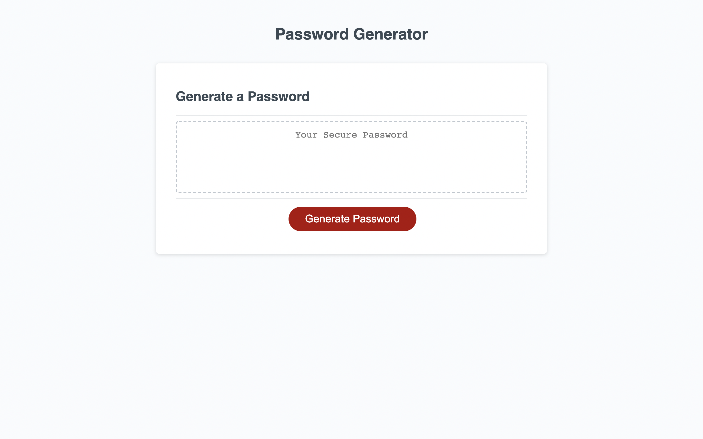

# Password Generator

## Description
This application uses JavaScript to get user input for password criteria and create a random password. I used a prompt to determine exactly how long the user's desired password would be. I then used confirm statements to ask whether the user would like lowercase letters, uppercase letters, numbers, and special characters. If the individual confirm statements were confirmed to want those characters, those certain character types were added to the "characters variable" I then used a for loop to loop through the original length determined to individually place a random character from the determined characters. I also used validation methods to make sure the password length was between 8 and 128 characters and at least one character type was selected. The function to generate the password then writes the password to the page for the user.

## Built With
* HTMl
* JavaScript

## Screenshot

> This screenshot shows the password generator. Just click the button and you will be walked through the prompts to generate a random password.

## Website
https://spencermoyer22.github.io/password-generator/

## Contribution
Made by Spencer Moyer
